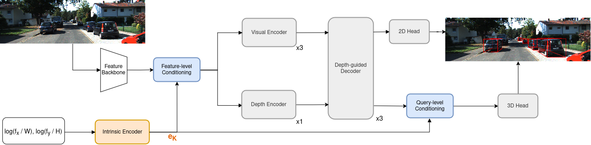
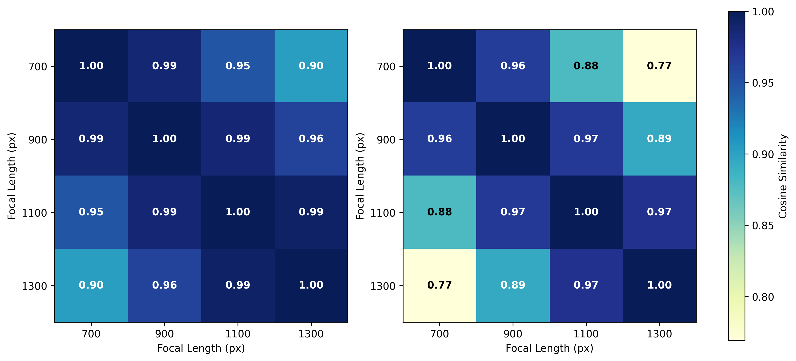
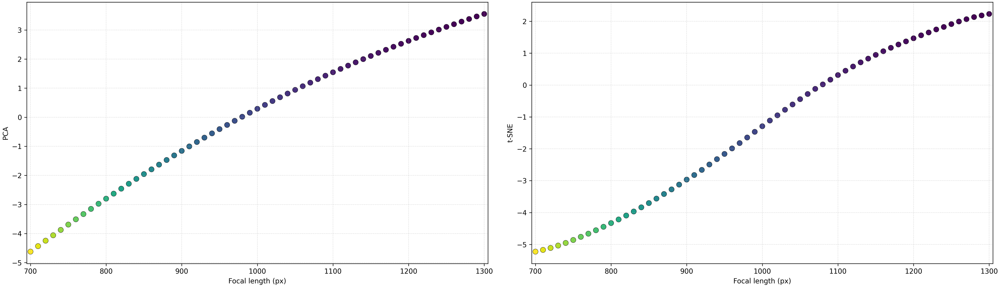

<h1 align="center">MonoBEN: Monocular 3D Object Detection Beyond Fixed Camera iNtrinsics</h1>

<p align="center">
  <a href="mailto:huy.nguyen2504@hcmut.edu.vn"><strong>Quoc Huy Nguyen</strong></a>,
  <a href="mailto:dai.lechi@hcmut.edu.vn"><strong>Chi Dai Le</strong></a>, and
  <a href="mailto:nddung@hcmut.edu.vn"><strong>Duc Dung Nguyen</strong></a><sup>*</sup>
  <br><br>
  <em>AITech Lab., Faculty of Computer Science and Engineering</em><br>
  <em>Ho Chi Minh City University of Technology (HCMUT)</em><br>
  <em>Vietnam National University Ho Chi Minh City</em><br>
  Ho Chi Minh City, Vietnam
  <br><br>
  <strong>RIVF 2026</strong>
  <br>
  <sup>*</sup>Corresponding author
</p>

---

<p align="center">
  <a href="#headline-results"><strong>Headline Results</strong></a> &nbsp;&middot;&nbsp;
  <a href="#abstract">Abstract</a> &nbsp;&middot;&nbsp;
  <a href="#overall-pipeline">Overall Pipeline</a> &nbsp;&middot;&nbsp;
  <a href="#generalization-on-synthetic-intrinsics">Generalization</a> &nbsp;&middot;&nbsp;
  <a href="#standard-kitti-results">Standard KITTI Results</a> &nbsp;&middot;&nbsp;
  <a href="#analytic">Analytic</a> &nbsp;&middot;&nbsp;
  <a href="#bibtex">BibTeX</a>
</p>

---

## Headline Results

MonoBEN holds accuracy at the native KITTI camera and degrades gracefully when the field of view shifts:

<table>
  <thead>
    <tr>
      <th align="left">Setting</th>
      <th align="left">Focal length</th>
      <th align="right">KITTI Val AP<sub>3D</sub></th>
      <th align="left">Performance</th>
    </tr>
  </thead>
  <tbody>
    <tr>
      <td align="left">Anchor focal</td>
      <td align="left">700 px</td>
      <td align="right"><strong>24.20</strong></td>
      <td align="left"><code>██████████████████████████████</code></td>
    </tr>
    <tr>
      <td align="left">Interpolated focal</td>
      <td align="left">1200 px</td>
      <td align="right"><strong>20.89</strong></td>
      <td align="left"><code>██████████████████████████░░░░</code></td>
    </tr>
  </tbody>
</table>

**How to read this.** 700 px is one of the predefined **focal anchors** (700 / 900 / 1100 / 1300 px). 1200 px falls
strictly between the 1100 px and 1300 px anchors, so it is an **interpolated** focal, not an *unseen* one &mdash; both
values lie inside the `U(700, 1300) px` range MonoBEN samples from during training. What actually changes at
1200 px is that anchor-table methods must interpolate to reach it, whereas MonoBEN evaluates the focal
continuously and without interpolation.

> **Provenance of the two bars.** 24.20 is MonoBEN's KITTI Validation *Moderate* AP<sub>3D</sub> at the native KITTI
> camera (f &asymp; 721 px, i.e. the 700 px bucket) &mdash; the number reported in
> [Standard KITTI Results](#standard-kitti-results); the cross-focal sweep in
> [Generalization on Synthetic Intrinsics](#generalization-on-synthetic-intrinsics) reports 23.64 at exactly 700 px.
> 20.89 is the AP<sub>3D</sub> at the 1200 px interpolated focal from that same sweep.

---

## Abstract

Monocular 3D object detection suffers severe performance degradation when deployed with camera intrinsics unseen during training. Existing solutions rely on large language models and vision-language encoders to map discrete focal anchors to semantic embeddings, forcing brittle interpolation for out-of-range focal lengths and burdening the detector with heavyweight auxiliary networks. We argue that camera intrinsics lie on a continuous geometric manifold that can be encoded directly, rendering semantic priors and discrete anchors unnecessary. We present MonoBEN, a unified intrinsic-aware detector that encodes continuous, logarithmically normalized focal parameters through a lightweight numeric encoder, and hierarchically injects the resulting geometric embedding at both the feature and query levels to explicitly condition the detection pipeline on projection geometry. On KITTI, MonoBEN achieves superior generalization to both interpolated and extrapolated unseen focal lengths compared to state-of-the-art intrinsic-aware methods, while matching competitive accuracy under standard fixed-camera evaluation. Notably, this robustness comes with fewer parameters and no additional computational overhead.

**Keywords:** monocular 3D object detection, camera intrinsics, cross-focal generalization.

---

## Overall Pipeline

<p align="center">
  
</p>

MonoBEN is a unified intrinsic-aware detector built on the depth-guided transformer design of MonoDETR. Given an
input image, a backbone extracts multi-scale visual features. In parallel, the camera focal lengths are
normalized by the image dimensions, mapped into the logarithmic domain, and encoded into an intrinsic embedding
`e_K` by a lightweight two-layer MLP with GELU activations &mdash; trained end-to-end with no lookup table and no
auxiliary loss.

The log transform matters. Raw normalized intrinsics are **collinear** under aspect-ratio-preserving focal
scaling, `r(f<sub>2</sub>) = α · r(f<sub>1</sub>)`, so all focal lengths lie on a single ray in the input
space and give an MLP almost no directional separation. The logarithmic mapping converts multiplicative scaling
into an additive shift,
`r<sub>log</sub> = [log(f<sub>x</sub>/W), log(f<sub>y</sub>/H)]`, restoring directional separation while leaving
adjacent configurations smoothly connected.

The resulting embedding is injected **hierarchically at two levels**:

- **Feature-level** &mdash; `e_K` is spatially broadcast and added to the projected multi-scale features before the
  visual and depth encoders, conditioning both visual appearance and depth reasoning.
- **Query-level** &mdash; `e_K` is added directly to the decoded object queries before 3D box regression, so the
  3D heads interpret object-level features through the underlying projection geometry.

During training a target focal length is drawn independently for every sample from a continuous uniform
distribution, `f′ ~ U(700, 1300) px`; the image is warped to match the target field of view and resized back
to its original resolution. This gives dense coverage of the whole interval rather than a handful of discrete
anchors. At inference, arbitrary intrinsics are handled on the fly &mdash; **continuous, interpolation-free, and
without any external language model**.

---

## Generalization on Synthetic Intrinsics

We report AP<sub>3D</sub> (IoU &ge; 0.7) on KITTI Validation across 17 focal lengths spanning 600&ndash;1400 px,
stress-testing robustness to varying perspective scales. Each focal length is tagged by type:

- **Anchor** &mdash; 700, 900, 1100, 1300 px, the predefined discrete anchors.
- **Interpolated** &mdash; in-range but non-anchor focals, which require an anchor-based method to interpolate.
- **Extrapolated** &mdash; out-of-range focals (600, 650, 1350, 1400 px) outside anything seen in training.

| Focal (px) | Type | MonoDETR | MonoDGP | MonoCoP | MonoIA (Paper) | MonoIA&#8224; (Repro.) | MonoBEN |
|:---:|:---|---:|---:|---:|---:|---:|---:|
| 600 | Extrapolated | 14.09 | 17.42 | 18.18 | **22.43** | 18.75 | <u>21.01</u> |
| 650 | Extrapolated | 16.67 | 19.28 | 21.70 | **23.41** | 21.43 | <u>22.16</u> |
| 700 | Anchor | 19.15 | 22.51 | <u>23.88</u> | **24.41** | 23.43 | 23.64 |
| 750 | Interpolated | 18.55 | 19.78 | 22.49 | <u>24.13</u> | **24.36** | 24.10 |
| 800 | Interpolated | 17.89 | 19.07 | 21.44 | 22.93 | **24.28** | <u>23.72</u> |
| 850 | Interpolated | 16.21 | 18.51 | 20.20 | 23.64 | <u>23.96</u> | **24.83** |
| 900 | Anchor | 18.90 | 21.04 | 23.30 | **24.36** | <u>23.99</u> | 23.59 |
| 950 | Interpolated | 16.54 | 17.33 | 18.61 | 22.48 | <u>23.31</u> | **23.59** |
| 1000 | Interpolated | 15.12 | 16.03 | 17.69 | 22.65 | **23.26** | <u>23.15</u> |
| 1050 | Interpolated | 15.06 | 15.63 | 16.43 | 22.52 | <u>22.80</u> | **22.92** |
| 1100 | Anchor | 16.76 | 19.96 | <u>22.59</u> | **23.69** | 22.44 | 22.19 |
| 1150 | Interpolated | 13.66 | 13.18 | 14.57 | 19.07 | <u>20.88</u> | **21.15** |
| 1200 | Interpolated | 12.30 | 12.43 | 13.46 | 20.54 | <u>20.79</u> | **20.89** |
| 1250 | Interpolated | 11.88 | 12.47 | 13.11 | **20.80** | 20.31 | <u>20.57</u> |
| 1300 | Anchor | 14.22 | 16.74 | 18.50 | **21.20** | <u>19.99</u> | 19.85 |
| 1350 | Extrapolated | 10.08 | 10.27 | 12.73 | **19.25** | 18.71 | <u>18.79</u> |
| 1400 | Extrapolated | 7.51 | 7.56 | 11.11 | 16.99 | **17.77** | <u>17.42</u> |
| **Avg** | — | 14.98 | 16.42 | 18.23 | **22.03** | 21.79 | <u>21.97</u> |

*Bold = best, underlined = second best. MonoIA&#8224; denotes results reproduced by us from the author-provided
checkpoint using our own implementation of their hybrid interpolation module, which is missing from the official
MonoIA source repository.*

**In-range superiority.** This reproduction exposes a discrepancy between MonoIA's reported figures and its
actual checkpoint performance: on the four primary training anchors MonoIA&#8224; scores 23.43 / 23.99 / 22.44 /
19.99, consistently below the 24.41 / 24.36 / 23.69 / 21.20 originally claimed. Across the nine interpolated
configurations MonoBEN averages **22.77**, ahead of both the paper-reported MonoIA (22.08, **+0.69**) and the
reproduced MonoIA&#8224; (22.66), and peaking at **24.83** at 850 px.

**Extrapolation.** Outside the training range, MonoBEN still leads every competing intrinsic-aware method that
we could fairly evaluate: 21.01 at 600 px (**+2.26** over MonoIA&#8224;) and 22.16 at 650 px (**+0.73**),
averaging 19.85 across the four extrapolated focals against 19.16 for MonoIA&#8224;.

**Overall.** Across all 17 focal lengths MonoBEN averages **21.97**, essentially matching the paper-reported
MonoIA (22.03) and clearly ahead of the reproduced MonoIA&#8224; (21.79) &mdash; without a single offline
language&ndash;image pipeline or embedding interpolation.

---

## Standard KITTI Results

Beyond cross-focal robustness, we check that intrinsic-aware adaptation does not compromise standard detection.
Methods relying on extra data (LiDAR / Depth) are marked explicitly for fair comparison.

### KITTI Test (Leaderboard)

| Method | Extra Data | AP<sub>3D</sub> Easy | AP<sub>3D</sub> Mod. | AP<sub>3D</sub> Hard | AP<sub>BEV</sub> Easy | AP<sub>BEV</sub> Mod. | AP<sub>BEV</sub> Hard |
|:---|:---:|---:|---:|---:|---:|---:|---:|
| **OccupancyM3D** | LiDAR | 25.55 | 17.02 | 14.79 | 35.38 | 24.18 | 21.37 |
| **OPA-3D** | Depth | 24.68 | 17.17 | 14.14 | 32.50 | 23.14 | 20.30 |
| **MonoTAKD** | LiDAR | 27.91 | 19.43 | 16.51 | 38.75 | 27.76 | 24.14 |
| **MonoUNI** | None | 24.75 | 16.73 | 13.49 | &mdash; | &mdash; | &mdash; |
| **MonoDETR** | None | 25.00 | 16.47 | 13.58 | 33.60 | 22.11 | 18.60 |
| **MonoCD** | None | 25.53 | 16.59 | 14.53 | 33.41 | 22.81 | 19.57 |
| **MonoMAE** | None | 25.60 | 18.84 | <u>16.78</u> | 34.15 | 24.93 | 21.76 |
| **MonoDGP** | None | 26.35 | 18.72 | 15.97 | 35.24 | 25.23 | 22.02 |
| **MonoCoP** | None | 27.54 | 19.11 | 16.33 | 36.77 | 25.57 | 22.62 |
| **MonoIA** | None | **29.52** | **20.29** | **17.93** | <u>37.55</u> | **26.59** | **23.26** |
| **MonoBEN** | None | <u>28.60</u> | <u>19.42</u> | 16.64 | **37.69** | <u>25.98</u> | <u>22.89</u> |

### KITTI Validation

| Method | Extra Data | AP<sub>3D</sub> Easy | AP<sub>3D</sub> Mod. | AP<sub>3D</sub> Hard | AP<sub>BEV</sub> Easy | AP<sub>BEV</sub> Mod. | AP<sub>BEV</sub> Hard |
|:---|:---:|---:|---:|---:|---:|---:|---:|
| **OccupancyM3D** | LiDAR | 26.87 | 19.96 | 17.15 | 35.72 | 26.60 | 23.68 |
| **OPA-3D** | Depth | 24.97 | 19.40 | 16.59 | 33.80 | 25.51 | 22.13 |
| **MonoTAKD** | LiDAR | 34.36 | 22.61 | 19.88 | 42.86 | 29.41 | 26.47 |
| **MonoUNI** | None | 24.51 | 17.18 | 14.01 | &mdash; | &mdash; | &mdash; |
| **MonoDETR** | None | 28.84 | 20.61 | 16.38 | 37.86 | 26.95 | 22.80 |
| **MonoCD** | None | 26.45 | 19.37 | 16.38 | 34.60 | 24.96 | 21.51 |
| **MonoMAE** | None | 30.29 | 20.90 | 17.61 | 40.26 | 27.08 | 23.14 |
| **MonoDGP** | None | 30.76 | 22.34 | 19.02 | 39.40 | 28.20 | 24.42 |
| **MonoCoP** | None | 32.06 | 23.98 | 20.64 | 42.20 | <u>31.29</u> | <u>27.58</u> |
| **MonoIA** | None | **33.61** | **24.40** | **20.80** | **44.69** | **32.17** | **27.93** |
| **MonoBEN** | None | <u>33.01</u> | <u>24.20</u> | <u>20.76</u> | <u>42.24</u> | 31.10 | 27.37 |

*Bold = best, underlined = second best. Car category, IoU<sub>3D</sub> &ge; 0.7.*

MonoBEN effectively acts as a **geometry-aware regularizer**: exposing the network to continuously shifting
intrinsic parameters deters overfitting to the pixel-to-metric mappings specific to the KITTI training split.
As a result MonoBEN improves on its base detector MonoCoP in **10 of the 12** metrics, gaining **+1.06 / +0.31 /
+0.31** AP<sub>3D</sub> on Test Easy / Mod. / Hard and **+0.27 to +0.92** AP<sub>BEV</sub> across every BEV
category.

Compared with MonoIA, MonoBEN reaches competitive validation accuracy (24.20 vs. 24.40 Moderate AP<sub>3D</sub>)
while trailing by 0.87&ndash;1.29 AP<sub>3D</sub> on the official Test set. We frame this as a deliberate
trade-off: MonoIA maximizes peak fixed-camera accuracy by optimizing discrete anchors that closely match KITTI's
limited camera diversity, whereas MonoBEN trades that peak for continuous cross-focal generalization and a
streamlined end-to-end architecture with no offline language dependency. All of this comes at
**42.37 M parameters and 71.77 GFLOPs** &mdash; parity with MonoCoP and MonoIA, with no additional network
overhead.

---

## Analytic

### Separation of the learned intrinsic embeddings

<p align="center">
  
</p>

*Pairwise cosine similarity of the learned intrinsic embeddings `e_K` across focal lengths. **Left:** embeddings
produced when the MLP is trained on raw normalized inputs `[f<sub>x</sub>/W, f<sub>y</sub>/H]`, which struggle to
decouple distant focal lengths (similarity **0.90** between 700 and 1300 px). **Right:** embeddings produced from
the log-normalized input `r_log`, which yields substantially better separation (**0.77**) while preserving local
smoothness between adjacent configurations.*

### The learned intrinsic manifold

<p align="center">
  
</p>

*Visualizations of the learned MonoBEN intrinsic embeddings, sampled densely from 700 to 1300 px, using PCA
(left) and t-SNE (right). Both projections reveal a strictly smooth, monotonic 1D manifold.*

Because the encoder input is fundamentally a 1D scalar focal length passed through a smooth MLP, an approximately
one-dimensional trajectory is mathematically expected &mdash; we present this as qualitative confirmation rather
than a novel discovery. What it verifies is that the numeric encoder faithfully carries the continuous geometric
variation of focal length into the high-dimensional latent space, with none of the fragmented clusters or abrupt
transitions inherent to discrete semantic embeddings.

---

## BibTeX

```bibtex
@inproceedings{nguyen2026monoben,
  title     = {{MonoBEN}: Monocular 3D Object Detection Beyond Fixed Camera {iN}trinsics},
  author    = {{Nguyen}, Quoc Huy and {Le}, Chi Dai and {Nguyen}, Duc Dung},
  booktitle = {RIVF 2026},
  year      = {2026}
}
```
